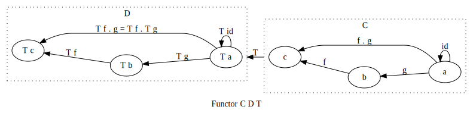
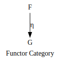
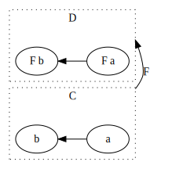

<div class="org-center">
FBI Warning

本文所有文字与图片遵循 <a rel="license" href="http://creativecommons.org/licenses/by-nc-nd/3.0/">CC 署名-非商业性使用-禁止演绎 3.0 许可协议</a><br/><a rel="license" href="https://creativecommons.org/licenses/by-nc-nd/3.0/deed.zh"></a>
</div>

-   **[第一部分：范畴论](./index.md)** 👈
-   [第二部分：食用猫呢](./part2.md)
-   [第三部分：搞基猫呢](./part3.md)

很多人都不明白什么是Monad，并不是因为不会用，不知觉可能就在用某种 monad。 定义和使用起来其实不难，困惑的大多应该是后面的这堆理论&#x2013; 范畴论。当然，我也没学过范畴论，只是略微看得懂写Haskell罢了。

我在书中[写过一章](https://book.douban.com/subject/26883736/)来解释，某人也尝试过很[写博客解释](http://www.ruanyifeng.com/blog/2017/02/fp-tutorial.html)，比如为了降低门槛用JS来，那Haskell/Scala的人出来喷你们前端这些不懂函数式的渣渣乱搞出来的东西根本就不是 monad。

我也画过一些图来解释，又会被嫌弃画风不好。但是，作为灵魂画师，我只 ~~是觉得自己萌萌的啊~~ 在乎画的灵魂是否能够给你一点启发。好吧，讲这么学术的东西，还是用dot来画吧，看起来好正规呢。

好了，安全带系好，我真的要开车了。为了 ~~防止鄙视链顶端的语言用户们喷再嫌弃~~ 解释的不到位，就用 Haskell 好了（虽然haskell也没到鄙视链顶），其实也不难解释清楚 ~~才怪~~ 。

这里面很多很装逼的单词，它们都是 *斜体* ，就算没看懂，把这些词记住也足够<ruby>装一阵子逼了<rt>买一阵子萌了</rt></ruby>。


<a id="org7ce30ed"></a>

# 第一部分：<ruby>范畴论<rt>Catergory Theory</rt></ruby>


<a id="org40bcb20"></a>

## *Category*

一个 *<ruby>范畴<rt>Category</rt></ruby>* 包含两个玩意

-   东西 `O` （Object）
-   两个东西的关系，箭头 `~>` （ *<ruby>态射<rt>Morphism</rt></ruby>* ）

一些属性

-   一定有一个叫 id 的箭头，也叫做 1
-   箭头可以 *<ruby>组合<rt> compose</rt></ruby>*

恩，就是这么简单


这些玩意对应到 haskell 的 typeclass 大致就是这样

```haskell
class Category (c :: * -> * -> *) where
  id :: c a a
  (.) :: c y z -> c x y -> c x z
```

> 注意到为什么我会箭头从右往左，你会发现这个方向跟 compose 的方向刚好一致

如果这是你第一次见到 Haskell 代码，没有关系，语法真的很简单 ~~才怪~~

-   `class` 定义了一个 TypeClass， `Category` 是这个 TypeClass 的名字
-   Type class 类似于定义类型的规范，规范为 `where` 后面那一坨
-   类型规范的对象是参数 `(c:: * -> * -> *)` ， `::` 后面是c的类型
-   c 是 *higher kind* ，跟higher order function的定义差不多，它是接收类型，构造新类型的类型。这里的 c 接收一个类型，再接收一个类型，就可以返回个类型。
-   `id:: c a a` 表示 c 范畴上的 a 到 a 的箭头
-   `.` 的意思 c 范畴上，如果喂一个 y 到 z 的箭头，再喂一个 x 到 y 的箭头，那么就返回 x 到 z 的箭头。

<ruby>简单吧<rt>hen nan ba</rt></ruby>?还没有高数抽象呢。


<a id="orge66bef3"></a>

### *Hask*

Haskell 类型系统范畴叫做 Hask

在 Hask 范畴上：

-   东西是类型
-   箭头是类型的变换，即 `->`
-   id 就是 id 函数的类型 `a -> a`
-   compose 当然就是函数组合的类型

```haskell
type Hask = (->)
instance Category (Hask:: * -> * -> *) where
  (f . g) x = f (g x)
```

我们看见新的关键字 `instance` ，这表示 Hask 是 Type class Category 的实例类型，也就是说我们可以Hask的个构造器去真的构造一个类型

比如：

```haskell
(->) a a
```

就构造了一个从a类型到a类型的的类型

构造出来的这个类型可以作为 id 函数的类型

```haskell
id :: (->) a a
```


<a id="org178a8c1"></a>

### *Duel*

每个 Category还有一个镜像，什么都一样，除了箭头是反的


<a id="orge14ae02"></a>

## *<ruby>函子<rt> Functor</rt></ruby>*

两个范畴中间可以用叫 Functor 的东西来连接起来，简称 T。



所以大部分把Functor/Monad比喻成盒子其实在定义上是错的，虽然这样比喻比较容易理解，在使用上问题也不大。但是，Functor只是从一个范畴到另一个范畴的映射关系而已。

-   范畴间 东西的 Functor 标记为 `T(O)`
-   范畴间 箭头的 Functor 标记为 `T(~>)`
-   任何范畴C上存在一个 T 把所有的 O 和 ~> 都映射到自己，标记为id functor 1<sub>C</sub>
    -   1<sub>C</sub>(O) = O
    -   1<sub>C</sub>(~>) = ~>

```haskell
class (Category a, Category b) => Functor a b t where
  fmap :: c a b -> d (t a) (t b)
```

`Functor a b t` 这表示从范畴 a 到范畴 b 的一个 Functor t

如果把范畴 a 和 b 都限制到 Hask 范畴

```haskell
class Functor (->) (->) t where
  fmap :: (->) a b -> (->) (t a) (t b)
```

`->` 在 Haskell 中是中缀类型构造器，所以是可以写在中间的

这样就会变成我们熟悉的 Funtor 的 Typeclass（把Functor 的第一第二个参数去掉的话）

```haskell
class Functor t where
  fmap :: (a -> b) -> (t a -> t b)
```

而 *<ruby>自函子<rt>endofunctor</rt></ruby>* 就是这种连接相同范畴的 Functor，因为它从范畴 Hask 到达同样的范畴 Hask

这里的 fmap 就是 T(~>)，在 Hask 范畴上，所以是 T(->), 这个箭头是函数，所以也能表示成 T(f) 如果 `f:: a -> b`


<a id="orgcea1901"></a>

## *<ruby>Cat<rt> +猫+</rt></ruby>*

当我们把一个Category看成一个object，functor看成箭头，那么我们又得到了一个Category，这种object是category的category我们叫它 &#x2013; *Cat*

已经没法讲了，看 TODO 图吧


<a id="orgc187241"></a>

## *<ruby>自然变换<rt>Natural Transformations</rt></ruby>*

Functor 是范畴间的映射，而 Functor 在 Cat 范畴又是个箭头，所以，Functor间的映射，也就是 Cat 范畴上的 Functor，叫做 *自然变换*


所以范畴 c 上的函子 f 到 g 的自然变化就可以表示成

```haskell
type Nat c f g = c (f a) (g a)
```

Hask 范畴上的自然变化就变成了

```haskell
type NatHask f g = f a -> g a
```

有趣的是，自然转换也满足箭头的概念，可以当成 functor 范畴上的箭头，所以又可以定义出来一个 Functor Catergory

-   东西是函子
-   箭头是自然变换

要成为范畴，还有两点

-   id 为 f a 到 f a 的自然变换
-   自然变换的组合



我们来梳理一下，已经不知道升了几个维度了，我们假设类型是第一维度

-   一维： Hask， 东西是类型，箭头是 ->
-   二维： Cat， 东西是 Hask， 箭头是 Functor
-   三维： Functor范畴， 东西是Functor， 箭头是自然变换

感觉到达三维已经是极限了，尼玛还有完没完了，每升一个维度还要起这么多装逼的名字，再升维度就要一脸懵逼了呢。虽然维度不算太高，但是已经不能用简单的图来描述了，所以需要引入 String Diagram。


<a id="org67e6596"></a>

## String Diagram

String Diagram 的概念很简单，就是点变线线变点。

当有了自然变换之后，没法表示了呀，那原来的点和线都升一维度，变成线和面，这样，就腾出一个点来表示自然变换了。


compose的方向是从右往左，从下到上。


<a id="orgc86fc4f"></a>

## *Adjunction Functor* 伴随函子

范畴C和D直接有来有回的函子，为什么要介绍这个，因为它直接可以推出 Monad

让我们来看看什么叫有来回。


其中：

-   一个范畴 C 可以通过函子 G 到 D，再通过函子 F 回到 C，那么 F 和 G 就是伴随函子。
-   &eta; 是 GF 到 1<sub>D</sub> 的自然变换
-   &epsilon; 是 1<sub>C</sub> 到 FG 的自然变换

同时根据同构的定义，G 与 F 是 *同构* 的。

同构指的是若是有

```haskell
f :: a -> b
f':: b -> a
```

那么 f 与 f' 同构，因为 f . f' = id = f' . f

伴随函子的 FG 组合是 C 范畴的 id 函子 F . G = 1<sub>c</sub>


Functor 不仅横着可以组合，竖着(自然变换维度)也是可以组合的，因为自然变换是 Functor 范畴的箭头。


当到组合 F &eta; . &epsilon; F 得到一个弯弯曲曲的 F 时，我们可以拽着F的两段一拉，就得到了直的 F。

String Diagram 神奇的地方是所有线都可以拉上下两端，这个技巧非常有用，在之后的单子推导还需要用到。


<a id="orgd84eddd"></a>

## 从伴随函子到 <ruby>单子<rt> Monad</rt></ruby>

有了伴随函子，很容易推出单子，让我们先来看看什么是单子

-   首先，它是一个 endofunctor T
-   有一个从 i<sub>c</sub> 到 T 的自然变化 &eta; (eta)
-   有一个从 T<sup>2</sup> 到 T 的自然变化 &mu; (mu)


```haskell
class Endofunctor c t => Monad c t where
  eta :: c a (t a)
  mu  :: c (t (t a)) (t a)
```

同样，把 c = Hask 替换进去，就得到更类似我们 Haskell 中 Monad 的定义

```haskell
class Endofunctor m => Monad m where
  eta :: a -> (m a)
  mu :: m m a -> m a
```

要推出单子的 &eta; 变换，只需要让 FG = T


同样的，当 FG = T, F &eta; G 就可以变成 &mu;


<a id="org7486dd8"></a>

### 三角等式

三角等式是指 &mu; . T &eta; = T = &mu; . &eta; T

要推出三角等式只需要组合 F &eta; G 和 &epsilon; F G


换到代码上来说

```haskell
class Endofunctor m => Monad m where
  (mu . eta) m = m
```

同样的，左右翻转也成立


T &eta; 就是 fmap eta

```haskell
(mu . fmap eta) m = m
```

如果把 `mu . fmap` 写成 `>>=` , 就有了

```haskell
m >>= eta = m
```


<a id="org1495394"></a>

### 结合律

单子另一大定律是结合律，让我们从伴随函子推起

假设我们现在有函子 F &eta; G 和 函子 F &eta; G F G, compose 起来会变成 F &eta; G . F &eta; G F G 

用 F G = T ， F &eta; G = &mu; 代换那么就得到了单子的 &mu; . &mu; T 

当组合 F &eta; G 和 F G F &mu; G 后，会得到一个镜像的图 

对应到单子的 &mu; . T &mu; 

结合律是说 &mu; . &mu; T = &mu; . T &mu; , 即图左右翻转结果是相等的，为什么呢？看单子的String Diagram 不太好看出来，我们来看伴随函子

如果把左图的左边的 &mu; 往上挪一点，右边的 &mu; 往下挪一点，是不是跟右图就一样了 

结合律反映到代码中就是

```haskell
mu . fmap mu = mu . mu
```

代码很难看出结合在哪里，因为正常的结合律应该是这样的 (1+2)+3 = 1+(2+3)，但是不想加法的维度不一样，这里说的是自然变换维度的结合，可以通过String Diagram 很清楚的看见结合的过程，即 &mu; 左边的两个T和先 &mu; 右边两个 T 是相等的。


<a id="org84812df"></a>

## Yoneda lemma / ~~米田共~~ 米田引理

米田引理是说所有Functor `f a` 一定存在 embed 和 unembed，使得 `f a` 和 `(a -> b) -> F b` isomorphic 同构

haskell还要先打开 RankNTypes 的 feature

```haskell
{-# LANGUAGE RankNTypes #-}

embed :: Functor f => f a -> (forall b . (a -> b) -> f b)
embed x f = fmap f x

unembed :: Functor f => (forall b . (a -> b) -> f b) -> f a
unembed f = f id
```

embed 可以把 functor `f a` 变成 `(a -> b) -> f b`

unembed 是反过来， `(a -> b) -> f b` 变成 `f a`

上个图就明白了




<a id="org3e6746e"></a>

### Rank N Type

-   Monomorphic Rank 0 / 0级单态: t
-   Polymorphic Rank 1 / 1级 ~~变态~~ 多态: forall a. a -> t
-   Polymorphic Rank 2 / 2级多态: (forall a. a -> t) -> t
-   Polymorphic Rank 3 / 3级多态: ((forall a. a -> t) -> t) -> t

看rank几只要数左边 forall 的括号嵌套层数就好了

一级多态锁定全部类型变化中的类型a

二级多态可以分别确定 a -> t 这个函数的类型多态

比如

```haskell
rank2 :: (forall a. a -> a) -> (Bool, Char)
rank2 f = (f True, f 'a')
```

-   f 在 `f True` 时类型 `Boolean -> Boolean` 是符合 `forall a. a->a` 的
-   在 `f 'a'` 时类型是 `Char -> Char` 也符合 `forall a. a->a`

但是到 rank1 类型系统就懵逼了

```haskell
rank1 :: forall a. (a -> a) -> (Bool, Char)
rank1 f = (f True, f 'a')
```

f 在 `f True` 是确定 a 是 Boolean，在rank1多态是时就确定了 `a->a` 的类型一定是 `Boolean -> Boolean`

所以到 `f 'a'` 类型就挂了。


<a id="orgc62a7fc"></a>

## *Kleisli Catergory*


Functor 的 Catergory 叫做 Functor Catergory，因为有箭头 &#x2013; 自然变换。Monad 也可以定义出来一个 Catergory（当然由于Monad是 Endofunctor，所以他也可以是 自函子范畴），叫做 Kleisli Catergory，那么 Kleisli 的箭头是什么？

我们看定义，Kleisli Catergory

1.  箭头是 Kleisli 箭头 `a -> T b`
2.  东西就是c范畴中的东西. 因为 a 和 b 都是 c 范畴上的， 由于T是自函子，所以 T b 也是 c 范畴的

看到图上的 <ruby>T f<rt> fmap f</rt></ruby> 和 &mu; 了没？

```haskell
f :: b -> T c
fmap f :: T b -> T^2 c
mu :: T^2 c -> T c
```

紫色的箭头连起来（compose）就是 T f'，所以,

```haskell
tb >>= f = mu . fmap f tb
```

大火箭则是蓝色箭头的组合

```haskel
(f <=< g) = mu . T f . g = mu . fmap f . g
```

而且大火箭就是 Kleisli 范畴的 compose

```haskell
(<=<) :: Monad T => (b -> T c) -> (a -> T b) -> (a -> T c)
```


<a id="org46d983e"></a>

## Summary

第一部分理论部分都讲完了， 如果你读到这里还没有被这些<ruby>吊炸天<rt>乱七八糟</rt></ruby>的概念搞daze，接下来可以看看它到底跟我们编程有鸟关系呢？第二部分将介绍这些概念产生的一些实用的monad

-   👉 [第二部分：<ruby>食用猫呢<rt> Practical Monads</rt></ruby>](./part2.md)
-   [第三部分：<ruby>搞基猫呢<rt> Advanced Monads</rt></ruby>](./part3.md)

当然我还没空全部写完，如果有很多人<ruby>预定<rt>只要998</rt></ruby> Gumroad 上的 <script src="https://gumroad.com/js/gumroad.js"></script><a class="gumroad-button" href="https://gum.co/grokking-monad" target="_blank">Grokking Monad</a> 电子书的话，我可能会稍微写得快一些。毕竟，写了也没人感兴趣也怪浪费时间的。不过，我猜也没几个人能看到这一行，就当是自言自语吧，怎么突然觉得自己好分裂。


<a id="org48c54bd"></a>

# References

-   <http://dev.stephendiehl.com/hask>
-   <https://en.wikibooks.org/wiki/Haskell/Category_theory>
-   <https://www.youtube.com/watch?v=ZKmodCApZwk>
-   <https://www.youtube.com/watch?v=kiXjcqxVogE&list=PL50ABC4792BD0A086&index=5>
